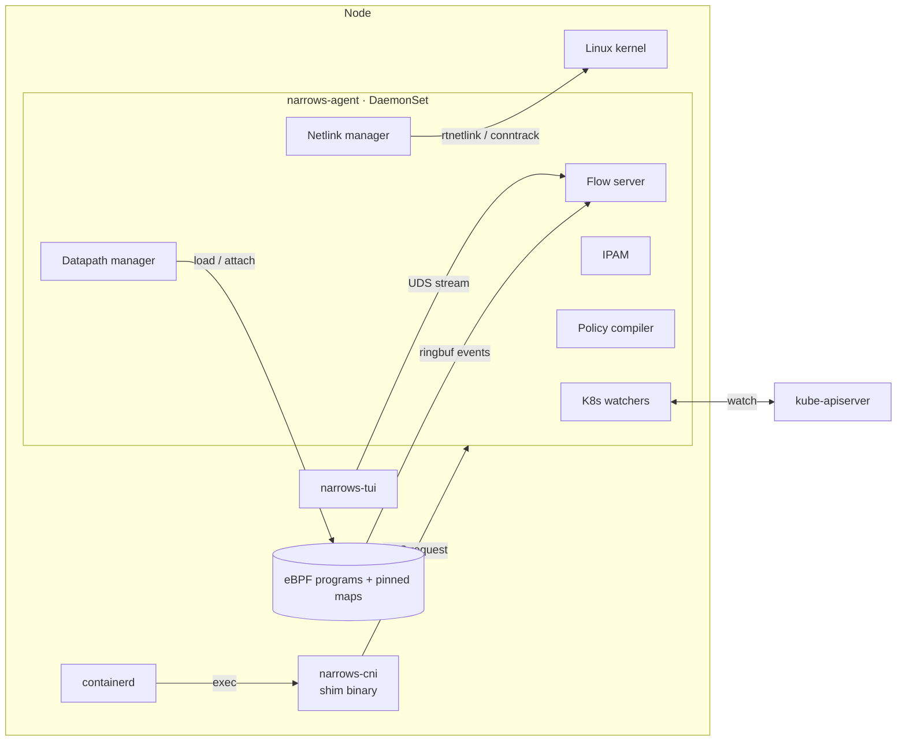

# Narrows: A Rust CNI with Built-in Flow Visibility

**Architecture and Build Plan** · Draft v0.1 · September 2026

> _Narrows_ is a working name. Rename freely.

---

## 1. Purpose

Narrows is a Kubernetes network provider written in Rust. It has two goals, in priority order:

1. **Learning.** Every layer from the CNI exec contract down to eBPF redirects should be built deliberately enough that its behaviour is understood, not just configured.
2. **Doing it properly.** Even as a learning project, the implementation should be fast, correct under failure, and follow the patterns production CNIs converged on.

A first-class **observability plane** runs alongside the datapath. It streams flow and drop events from the kernel to a terminal UI, so you can watch what the network is doing while you build it.

### 1.1 Non-goals

- Competing with Cilium or Calico on features.
- Replacing kube-proxy early. It stays in place, in nftables mode, until a late stretch phase.
- Windows, multi-network pods (Multus-style), L7 policy, or encryption. These are stretch items at most.
- Supporting old kernels. The target is a modern LTS kernel (see §2.2).

### 1.2 Library philosophy

**Build yourself** anything that _is_ the learning:

- CNI types and wire handling
- IPAM
- the first netlink calls
- the agent–shim protocol
- the policy compiler
- flow enrichment

**Take a dependency** for mature infrastructure that would be pure yak-shaving to rebuild:

- eBPF loading and verification plumbing (Aya)
- the Kubernetes API client (kube-rs)
- the async runtime (tokio)
- the terminal UI framework (ratatui)

The full budget is in §9.

---

## 2. Background and Constraints

### 2.1 The contract Narrows implements

The runtime (containerd or CRI-O) execs the plugin binary. All communication goes through environment variables, stdin, stdout, stderr, and the exit code. Narrows targets **CNI spec v1.1**, which adds two verbs to the classic ADD/DEL/CHECK/VERSION:

- **STATUS** lets the plugin report whether it can accept ADD requests. Runtimes no longer have to infer readiness from the presence of a config file.
- **GC** passes the plugin the set of known-good attachments, so it can clean up leaked resources such as IPAM reservations.

v1.1 also adds `mtu` fields to interface and route results, and allows a config to advertise multiple supported versions.

Two spec details matter for the design:

- **Delegated STATUS.** A plugin that delegates to another (for example, IPAM) must forward STATUS to it and fail if the delegate fails.
- **libcni's DEL fallback.** libcni synthesizes a DEL for stale cached attachments even when the plugin doesn't implement GC. DEL must therefore be idempotent and safe to receive for attachments the plugin has already forgotten.

### 2.2 Kernel baseline

| Feature                                | Minimum kernel            | Used in phase |
| -------------------------------------- | ------------------------- | ------------- |
| BPF ring buffer                        | 5.8                       | 4             |
| tcx (link-based TC attach, multi-prog) | 6.6                       | 4             |
| netkit device                          | 6.7 (Cilium requires 6.8) | 6             |

**Recommendation:** develop on **6.8 or newer**. Ubuntu 24.04 LTS ships a kernel with `CONFIG_NETKIT=y` enabled by default, which makes it a convenient baseline.

Aya's `SchedClassifier` attach uses tcx automatically on 6.6+ and falls back to legacy netlink TC on older kernels. Narrows can support both without extra work, but it only _tests_ tcx.

### 2.3 What stays outside Narrows

| Concern                      | Owner                                                                                                                                     |
| ---------------------------- | ----------------------------------------------------------------------------------------------------------------------------------------- |
| Service VIPs                 | kube-proxy, nftables mode. GA since 1.33, but iptables is still the default, so enable it explicitly. IPVS mode is deprecated as of 1.35. |
| DNS                          | CoreDNS                                                                                                                                   |
| Pod CIDR allocation per node | kube-controller-manager, which populates `Node.spec.podCIDRs`                                                                             |

---

## 3. System Overview

### Components

| Component        | Kind                                | Lifetime                    | Responsibility                                                                                |
| ---------------- | ----------------------------------- | --------------------------- | --------------------------------------------------------------------------------------------- |
| `narrows-cni`    | Static binary in `/opt/cni/bin`     | Milliseconds per invocation | Parse the CNI request, forward it to the agent, return the result.                            |
| `narrows-agent`  | DaemonSet, host network, privileged | Long-running                | Owns all state: IPAM, netlink programming, eBPF lifecycle, policy, flows.                     |
| `narrows-ebpf`   | `no_std` eBPF programs (Aya)        | Loaded into the kernel      | Fast-path forwarding, policy enforcement, flow and drop events.                               |
| `narrows-common` | Shared `no_std` crate               | n/a                         | POD structs shared by kernel and userspace: map keys and values, event records, drop reasons. |
| `narrows-tui`    | Binary, shipped in the agent image  | Interactive                 | Visualizes flows, drops, routes, conntrack, and per-pod paths.                                |

### 3.1 Why a thin shim plus an agent

The runtime execs a fresh process for every pod operation. If the plugin itself held state, it would need file locks for concurrency, would re-open netlink sockets on every call, and would have no view of cluster topology.

Delegating to a long-lived agent over a Unix domain socket (the pattern Cilium uses) keeps the shim tiny and fast, and puts all state behind a single owner.

**The cost:** if the agent is down, no pod can get networking. STATUS exists precisely to report that honestly.

**Learning path:** Phase 1 deliberately builds a _fat_ plugin first, so you feel the pain the split solves. Phase 2 refactors it into the shim/agent design.

---

## 4. The CNI Shim (`narrows-cni`)

**Design rules**

- **Synchronous and allocation-light.** No async runtime. Use blocking I/O on a single UDS connection with a hard timeout.
- **Statically linked (musl)** so it runs on any node image.
- **stdout carries only the CNI result or error JSON.** Diagnostics go to stderr and a rotating log file under `/var/log/narrows/`.
- **Exit codes and error codes follow the spec.** Exit 0 on success and 1 on failure, with an error result on stdout. Use a well-known spec code wherever one fits, and the plugin-specific range (100+) only for errors the spec doesn't cover.

**Supported versions:** `1.0.0` and `1.1.0`. Narrows only produces 1.x results. STATUS and GC also require a config version of at least `1.1.0`.

**Error codes**

| Code | Meaning                                            | Source   | Narrows use                                                                         |
| ---- | -------------------------------------------------- | -------- | ----------------------------------------------------------------------------------- |
| 1    | Incompatible CNI version                           | spec     | Unsupported `cniVersion`, or STATUS/GC with a config older than 1.1.0               |
| 4    | Invalid necessary environment variables            | spec     | Missing or unknown `CNI_COMMAND`, missing required vars, bad container ID or ifname |
| 5    | I/O failure                                        | spec     | Reading stdin failed                                                                |
| 6    | Failed to decode content                           | spec     | stdin isn't JSON of the expected shape, or exceeds 1 MiB                            |
| 7    | Invalid network config                             | spec     | Missing or malformed `cniVersion`, `name`, or `type`                                |
| 11   | Try again later                                    | spec     | Agent unavailable on ADD, DEL, CHECK, or GC (Phase 2)                               |
| 50   | Plugin not available                               | spec     | Agent unavailable on STATUS (Phase 2)                                               |
| 51   | Not available; existing pods may have limited connectivity | spec | Datapath degraded on STATUS (later)                                             |
| 100  | Not implemented                                    | Narrows  | Verb recognized but not built yet                                                   |
| 101  | IPAM pool exhausted                                | Narrows  | Every usable address in the node's pool is leased                                   |
| 102  | IPAM state corrupt                                 | Narrows  | The lease file can't be parsed, or its leases contradict the pool                   |
| 103+ | Narrows-specific                                   | Narrows  | Unassigned                                                                          |

"Agent unavailable" was first planned as a plugin-specific code. The spec already has codes that tell the runtime what to do about it: 11 means retry, and 50 means not ready. libcni also defines 8 (`ErrInvalidNetNS`) and 999 (`ErrInternal`). Neither is in the spec's table, so Narrows doesn't use them.

**Verb handling**

| Verb                | Behaviour                                                         |
| ------------------- | ----------------------------------------------------------------- |
| VERSION             | Answered locally, without contacting the agent.                   |
| ADD, DEL, CHECK, GC | Forwarded to the agent.                                           |
| STATUS              | Forwarded to the agent. A connection failure is itself the error. |

**Budget**

Target a p99 of **under 5 ms** of shim overhead on top of the agent's work. Measure it from Phase 2 onward (§10).

---

## 5. The Agent (`narrows-agent`)

### 5.1 Internal structure

The agent is a set of **reconcilers**: desired state comes from the API server and local requests, actual state is read from the kernel, and loops converge the two. This is the same mental model as a GitOps controller.

| Subsystem        | Inputs                                                  | Outputs                                                              |
| ---------------- | ------------------------------------------------------- | -------------------------------------------------------------------- |
| Watchers         | Own Node, all Nodes, Pods on this node, NetworkPolicies | In-memory cache and change events                                    |
| IPAM             | Own Node's `podCIDRs`, ADD/DEL/GC                       | Address leases (persisted)                                           |
| Netlink manager  | Endpoint and peer-node changes                          | Links, addresses, routes, neighbours, FDB entries, conntrack flushes |
| Datapath manager | Endpoint table, config                                  | Loaded programs, attached links, map contents                        |
| Policy compiler  | NetworkPolicies, pod labels, endpoint table             | Per-endpoint policy maps                                             |
| Flow server      | Ringbuf events, conntrack events, cache                 | Enriched flow stream and state snapshots over UDS                    |

**Concurrency model:** a single tokio runtime. Each subsystem owns its state and receives commands over bounded channels. No shared mutable state crosses subsystem boundaries.

### 5.2 Startup and restart

1. Load persisted IPAM state.
2. Scan the kernel for existing Narrows-owned links, routes, and pinned maps.
3. Sync the watcher caches.
4. Reconcile, removing orphans and re-creating anything missing.
5. **Only then** report ready to STATUS and to the readiness probe.

**Agent restarts must not disrupt running pods.** Pin eBPF maps and links in bpffs so the datapath keeps forwarding while userspace is gone. tcx and link-based attachments support atomically replacing a program on upgrade.

### 5.3 IPAM

**Source of truth**

- The pool is `Node.spec.podCIDRs`. In Phase 1 there's no Kubernetes client, so the fat plugin reads the pool from `ipam.subnet` in each node's conflist.
- The agent never allocates node CIDRs itself. That requires the controller-manager to be running with node CIDR allocation enabled; kind and k0s both do this.

**Allocator**

- A bitmap over the node's range, with the network and broadcast addresses reserved. The gateway is link-local (§6.1), so no pod-CIDR address is set aside for it. Kubernetes' `ipallocator` and CNI `host-local` never hand out network or broadcast either; `host-local` also reserves `.1`, because the bridge plugin puts its gateway there.
- Pool prefixes from `/16` to `/30` are accepted, which bounds bitmap memory and guarantees at least two usable addresses.
- Allocation scans for the first free bit, starting after the last allocated position (next-fit), to delay reuse.

**Lease key**

- `(containerID, ifname)`, matching how the spec identifies an attachment.
- ADD with an existing key returns the existing lease. DEL for an unknown key succeeds.

**Persistence**

- A single state file, written as temp file → fsync → atomic rename, then an fsync of the directory so the rename itself is durable.
- Writes are batched, but ADD does not return until its lease is durable.
- **Locking.** In Phase 1 the plugin is a fresh process per operation, so concurrent ADDs race over the file. An exclusive `flock` covers the whole read-modify-write. The lock lives on a sibling `.lock` file, because the rename in an atomic save would detach a lock held on the state file's own inode. Phase 2 retires this: the agent is the single owner and holds the state in memory.
- **Format.** JSON, carrying a `version` field from the first release. An unknown version is an error, not a guess (§14.7).
- **Pool changes.** State saved for a different pool is discarded on load. A reassigned node CIDR makes every old lease invalid.

**Reuse safety**

- Released IPs enter a short **quarantine** before they can be handed out again.
- On release, conntrack entries referencing that IP are flushed (as discussed earlier: stale flows must not reach a new pod).

**GC**

- Any lease not present in the runtime's valid-attachments list is released.
- Leases younger than a grace window are skipped, to avoid racing an in-flight ADD.

### 5.4 RBAC and privileges

**RBAC**

- `get`, `list`, `watch` on nodes, pods, namespaces, and networkpolicies.
- No write access to cluster objects is needed early on. Status reporting can come later through events.

**Pod settings**

- `hostNetwork: true`.
- Capabilities `NET_ADMIN`, `BPF`, `PERFMON`, and `SYS_ADMIN` (needed for setns and some bpffs operations; try to drop it later and document what breaks).
- Mounts for `/sys/fs/bpf`, `/opt/cni/bin`, `/etc/cni/net.d`, `/var/run/narrows`, and the netns directory.

**Install and upgrade**

- An init container copies the shim binary into place (temp file + rename) and writes the conflist last, so the runtime never sees a config pointing at a missing binary.

---

## 6. Datapath

### 6.1 Pod interface model: routed L3, no bridge

Every pod gets:

- A `/32` (IPv4) on `eth0`.
- A default route to a fixed link-local gateway address: **`169.254.1.1`** (`narrows_cni::result::GATEWAY`), the same choice Calico makes. Every pod-facing interface answers ARP for it; no per-pod or per-node bookkeeping is needed.
- A static neighbour entry for that gateway.

On the host side, the peer interface gets a `/32` route to the pod.

**Why L3 point-to-point instead of a bridge**

- No MAC learning, no ARP flooding, and no bridge netfilter interactions.
- Every pod is just a route, which maps one-to-one onto eBPF lookups later.
- It is the same shape as netkit L3 mode, which Cilium recommends because it removes ARP handling entirely.

The trade-off is that you must handle `ip_forward` and `rp_filter` sysctls explicitly.

### 6.2 MTU

- The agent computes pod MTU as underlay MTU minus encapsulation overhead (50 bytes for VXLAN over IPv4).
- The value is returned in the CNI result using the v1.1 `mtu` field.
- MTU gets a dedicated test, because mistakes here are silent and severe. In one Cilium bug, WireGuard pod-to-pod throughput sat around 102 Mbit/s and rose to about 656 Mbit/s once tunnel overhead was included in the route MTU.

### 6.3 Cross-node forwarding, kernel-native first

**Mode A: native routing (host-gw)**

- For each peer Node, install a route from its pod CIDR to its node IP.
- Requires L2 adjacency between nodes. Zero encapsulation cost.
- The simplest possible multi-node design, and the baseline for every later performance comparison.

**Mode B: VXLAN overlay**

- One kernel VXLAN device per node.
- The agent programs FDB and neighbour entries directly from the Node watch, so there is no multicast or flood learning.
- Works across L3 boundaries.

**Egress masquerade**

- Traffic to non-cluster destinations is SNATed.
- Initially this is a small nftables table the agent owns, programmed over netlink rather than by shelling out.
- In Phase 4 it moves to eBPF.

### 6.4 eBPF fast path (Phase 4)

**Programs** (tcx-attached)

- Host-side pod interface, ingress: traffic leaving the pod.
- Physical or overlay device, ingress: traffic arriving from other nodes.
- Optional egress hooks, for observability only.

**Maps**

- **Endpoint map:** pod IP → ifindex, MAC, endpoint ID, and policy map reference.
- **Node map:** pod CIDR (LPM trie) → peer node IP and tunnel info.
- **Config map:** feature flags, including the observability toggle.
- **Per-CPU counters:** packets and bytes per endpoint and per drop reason.

**Forwarding decisions**

- Local destination: redirect straight into the target pod's namespace using the peer-redirect helper.
- Remote destination: use neighbour-aware redirect out of the underlay or tunnel device.
- Anything else, including Service VIPs: return to the stack unchanged.

> **Critical hazard: NAT and conntrack bypass.** eBPF redirects skip host netfilter. kube-proxy's DNAT is undone on the reply path by conntrack in netfilter. If a reply from a Service backend is redirected directly to the client pod, the source is never rewritten back to the ClusterIP, and the client drops it.
>
> **Rule:** only fast-path a packet when it is known not to belong to a NATed flow. Use the kernel's conntrack lookup kfunc from TC programs, or fall back to the stack whenever in doubt. This is exactly why Cilium pairs eBPF host routing with its own kube-proxy replacement. Treat it as a learning milestone, and write a test that proves the failure before writing the fix.

### 6.5 netkit (Phase 6)

**What changes**

- Replace veth with netkit in L3 mode.
- Pod-side programs attach _inside_ the peer device, managed from the host namespace.
- Configure the default policy to blackhole traffic if no program is attached, matching Cilium's behaviour.
- Keep veth as a runtime-detected fallback.
- Switching an existing node requires recreating its pods, as Cilium's documentation notes.

**Open question**

- Aya's support for netkit attachment was not confirmed while writing this plan. If it is missing, adding it is a well-scoped upstream contribution.

**Expected results**

- Lower latency and higher throughput than veth.
- One independent benchmark found netkit used noticeably more host CPU than veth at high stream counts, for about a 10% throughput gain. Measure CPU per Gbit, not just raw Gbit.

---

## 7. NetworkPolicy (Phase 5)

### 7.1 Approach

**Enforcement lives in eBPF, keyed by IP.** The policy compiler turns each NetworkPolicy into per-endpoint ingress and egress maps:

- **Key:** peer prefix (LPM), protocol, port.
- **Value:** allow or deny.
- **Default:** endpoints not selected by any policy skip the lookup entirely.

**Statefulness**

- Return traffic for allowed connections is permitted via conntrack state.
- Tracking can stay in kernel conntrack, queried from eBPF, or move to your own LRU map later. The second option is a deeper learning exercise.

**Label churn**

- Label changes recompile only the affected endpoints.
- The compiler is a pure function (policies, pods) → map contents, so it is heavily unit-testable.

### 7.2 Prior art worth reading

`kube-network-policies` (kubernetes-sigs) enforces policy in userspace via NFQUEUE. It avoids a large performance penalty by only capturing packets for pods that at least one policy targets.

Borrow that selectivity idea. Also use the project as a correctness oracle when behaviour is unclear.

---

## 8. Observability Plane

This is the "watch it work" feature. It is **optional at runtime** and costs almost nothing when disabled.

### 8.1 Event sources

| Source                                  | Available from | Data                                                                               |
| --------------------------------------- | -------------- | ---------------------------------------------------------------------------------- |
| Kernel conntrack event stream (netlink) | Phase 2        | New and destroyed flows, NAT tuples. Gives flow visibility before any eBPF exists. |
| Netlink dumps                           | Phase 1        | Links, routes, neighbours, FDB.                                                    |
| eBPF ring buffer                        | Phase 4        | Per-packet trace and drop events with reasons.                                     |
| eBPF per-CPU counters                   | Phase 4        | Always-on packet, byte, and drop counts.                                           |
| eBPF map snapshots                      | Phase 4        | Endpoint, node, and policy table contents.                                         |

**Why the ring buffer over the perf buffer**

- It is a single multi-producer, single-consumer (MPSC) queue shared across CPUs, which gives better memory efficiency.
- It preserves event ordering across CPUs, which the per-CPU perf buffer cannot.
- Its reserve/submit API avoids an extra copy.

### 8.2 Hot-path discipline

- **Gating.** Event emission is gated by one config-map lookup. When disabled, that lookup is the entire cost.
- **Sampling and scope.** When enabled, the agent can sample (1-in-N) and filter by endpoint, so the TUI can "follow a pod" without tracing the whole node.
- **Fixed-size events.** Records are fixed-size POD structs defined in `narrows-common`. There is no string formatting in the kernel.
- **Drop reasons.** These are a closed enum shared by both sides.
- **Overflow.** Reservation failures are counted, never retried.

### 8.3 Agent side

- A dedicated task drains the ring buffer.
- Events are enriched with the watcher cache (IP → namespace/pod/node).
- Enriched events are stored in a bounded in-memory ring, plus rolling aggregates such as top talkers and drop rates.

**Lesson from Hubble**

Hubble's server started as a standalone process. It was folded into the Cilium agent because it had to replicate so much agent state, which caused performance overhead and maintenance burden. Narrows embeds the flow server in the agent from day one.

**Protocol**

- Length-prefixed binary frames over a UDS, with a version byte and a small request set: subscribe with filter, snapshot tables, stats.
- gRPC is intentionally avoided to keep the dependency budget small. The accepted cost is that there is no free multi-node relay.

### 8.4 `narrows-tui`

**Access**

- The TUI binary ships inside the agent image and is launched through `kubectl exec`.
- No network exposure and no extra RBAC are needed.
- A later option is a local TCP listener reached via port-forward.

**Views**

1. **Overview:** endpoints on this node, peer nodes, datapath mode, kernel features detected.
2. **Live flows:** filterable by pod, namespace, port, or verdict. Shows forwarded, dropped, and NATed traffic.
3. **Drops:** grouped by reason, with the most recent examples.
4. **Pod path ("explain"):** for a chosen pod and destination, walks the decision chain. Interface → policy verdict → route or map lookup → encap → peer node, each annotated with live counters. This is the view that teaches the most.
5. **Conntrack:** live table filtered to cluster IPs, with a highlight when entries reference IPs no longer leased (stale-entry detection).
6. **Tables:** raw endpoint, node, and policy map contents next to the kernel route table.

---

## 9. Dependency Budget

| Crate                  | Used by     | Why it is worth it                                                  | Deliberately not used                         |
| ---------------------- | ----------- | ------------------------------------------------------------------- | --------------------------------------------- |
| `serde`, `serde_json`  | shim, agent | The CNI wire format is JSON. In use in `narrows-cni` since Phase 1 (`serde` with `derive`). The CNI types, validation, and version parsing on top are hand-written. | Hand-rolled JSON; `thiserror` in the shim (error impls are hand-written) |
| `aya`, `aya-ebpf`      | agent, ebpf | Pure-Rust eBPF loader with BTF/CO-RE, no libbpf and no C toolchain. | libbpf-rs, writing a loader                   |
| `tokio`                | agent, tui  | Async runtime for watchers, netlink, and the UDS server.            | Anything in the shim                          |
| `kube`, `k8s-openapi`  | agent       | Watch and cache machinery.                                          | Hand-rolled API client                        |
| `ratatui`, `crossterm` | tui         | Established TUI stack.                                              | n/a                                           |
| `libc`                 | shim, agent | `setns` and friends. In use in `narrows-cni` since Phase 1 (`netlink::socket`, `netns`): raw `AF_NETLINK` socket calls and `setns`. Already pulled in transitively by Aya. | `nix`, `rustix` (optional later)              |
| `tracing`              | agent       | Structured logs.                                                    | Used in the shim only if it stays lightweight |
| Netlink (see ADR-3)    | agent       | See ADR-3.                                                          | See ADR-3                                     |

**Test-only:** `proptest` for IPAM and the policy compiler (optional).

---

## 10. Performance Plan

### 10.1 What to measure

| Metric                                          | Tool                                              | Why                                         |
| ----------------------------------------------- | ------------------------------------------------- | ------------------------------------------- |
| ADD/DEL latency (p50, p99)                      | Agent histograms plus kubelet pod startup timings | Pod churn cost                              |
| Pod-to-pod throughput, same node and cross node | iperf3                                            | Datapath efficiency                         |
| Latency and transactions per second             | netperf TCP_RR, sockperf                          | Tail latency matters more than peak Gbit    |
| CPU per Gbit                                    | Node CPU during load                              | Exposes trade-offs like the netkit CPU cost |
| Service path overhead                           | netperf through ClusterIP                         | Validates the §6.4 NAT hazard handling      |
| Observability overhead                          | Same tests with events off, sampled, and full     | Proves the "costs nothing when off" claim   |

### 10.2 Baselines

- Run each test against **kindnet or Flannel host-gw** (the simple baseline) and **Cilium** (the ceiling), on the same nodes.
- Record results per phase in `bench/results/`, so every architectural change has a before/after number.

### 10.3 Principles

- No shelling out to `ip`, `nft`, or `conntrack` anywhere.
- Batch netlink operations, and keep a long-lived socket per protocol in the agent.
- No allocation or unbounded loops in eBPF programs. Use per-CPU maps for counters.
- Keep the shim small. Watch its binary size and startup time in CI.

---

## 11. Repository Layout

- `Cargo.toml` (workspace)
- `crates/`
  - `narrows-cni/`: shim binary
  - `narrows-agent/`: daemon, with modules `watch`, `ipam`, `netlink`, `datapath`, `policy`, `flows`, `api`
  - `narrows-ebpf/`: `no_std` eBPF programs
  - `narrows-common/`: shared POD types, drop reasons, protocol frames
  - `narrows-tui/`: terminal UI
- `xtask/`: builds eBPF objects, runs netns tests, packages the image. It sits at the repo root, the usual cargo-xtask layout, and runs as `cargo xtask` via `.cargo/config.toml`.
- `deploy/`: DaemonSet, RBAC, ConfigMap, and kind configs
- `tests/`
  - `netns/`: privileged integration tests against real namespaces
  - `e2e/`: kind-based cluster tests
- `bench/`: scripts and recorded results
- `docs/adr/`: architecture decision records

---

## 12. Phased Roadmap

Each phase has a learning goal and an exit criterion. Don't advance until the exit criterion is met and the benchmark is recorded.

### Phase 0: Lab and harness

**Build**

- A kind config with the default CNI disabled, multiple workers, and kube-proxy in nftables mode.
- A netns test harness that runs the plugin outside Kubernetes (using the CNI project's `cnitool` or your own runner).
- A privileged CI job.
- Later, a _separate_ k0s test cluster with `provider: custom`. Don't use your main homelab cluster: k0s only allows changing the network provider through a full cluster redeployment.

**Status**

- Done: the kind config (`deploy/kind/narrows.yaml`) and `docs/notes/dev-setup.md`.
- Still open: the netns harness, the privileged CI job, and the k0s cluster.
- The toolchain isn't pinned locally. The CI job pins it, and `rust-version` sets the minimum.

**kind gotcha:** kind nodes are containers sharing the host kernel. eBPF programs, pinned-map paths, and global sysctls are therefore shared across "nodes". Namespace every pin path and program name by node name from the start.

### Phase 1: Single-node fat plugin

**Learn:** the exec contract, network namespaces, veth pairs, rtnetlink.

**Build**

- VERSION, ADD, DEL, CHECK.
- The routed `/32` model.
- File-backed IPAM with locking.
- A conntrack flush on DEL.
- Hand-rolled netlink for the handful of messages needed (see ADR-3).

**Status**

- Done: file-backed IPAM with locking (`ipam::{cidr,allocator,store}`); the ADD result types (`result::AddResult`), not yet wired to a real ADD; a netlink message-encoding layer (`netlink::message`) and the messages built so far — veth-pair creation (`netlink::link::create_veth_pair`), deletion (`delete_link`), bringing a link up (`set_link_up`), address assignment (`netlink::addr`), and both routes, the pod's default route and the host's `/32` back to it (`netlink::route`); the socket layer that actually sends them (`netlink::socket::RouteSocket`, the crate's first `unsafe` code, isolated per AGENTS §3.2) and the `setns` namespace guard (`netns::enter`/`NetNsGuard`). **All of this has been exercised for real, with the human's explicit go-ahead** (AGENTS §1.2): built and run on real Linux inside a `--cap-add=NET_ADMIN --cap-add=SYS_ADMIN` container (`tests/netns/`, driven by `cargo xtask test-netns`) — a real veth pair created, brought up, addressed, routed, and deleted again; a real namespace entered and left. `cargo test --workspace` itself stays fully unprivileged, as AGENTS §4 requires; the privileged suite is a separate binary with no `#[test]` functions, never swept in.
- Two things learned only by testing against a real kernel, now documented where the code needs them: a freshly created link starts administratively down (`ENETDOWN` on anything routed through it until `set_link_up` runs); and `/sys/class/net`'s namespace-awareness is fixed at mount time, so it can't be used to confirm a `setns` switch worked — `/proc/*/ns/net` can (see `netns::enter`'s doc comment).
- Still open: `RTM_NEWLINK` to move the veth peer into the pod's netns and rename it; the gateway's `RTM_NEWNEIGH` neighbour entry; wiring ADD's dispatch to build and send all of this for real; DEL (release + conntrack flush); CHECK.

**Note on STATUS and GC:** these are Phase 2 verbs, but a runtime using a 1.1.0 config may call them. In Phase 1 the plugin parses them and answers code 100 (not implemented, §4). Phase 1 test conflists should set `cniVersion: "1.0.0"`, so the runtime never sends STATUS or GC.

**Exit:** two pods on one node can reach each other. `cnitool` ADD/DEL loops of 1,000 iterations leak nothing (no links, routes, or leases). DEL is idempotent.

### Phase 2: Agent and shim split

**Learn:** why production CNIs are daemons, reconciliation, STATUS and GC semantics.

**Build**

- The UDS protocol and the in-memory IPAM owner.
- The Node podCIDR watch.
- The DaemonSet installer.
- STATUS and GC.
- The conntrack event stream, plus the first TUI views (Overview and Conntrack).

**Exit:** killing the agent mid-ADD leaves no orphans after restart. GC reclaims deliberately leaked leases. STATUS flips correctly when the agent is down.

### Phase 3: Multi-node, kernel-native

**Learn:** routing between nodes, VXLAN, MTU, masquerade.

**Build**

- Host-gw mode, then VXLAN mode.
- nftables masquerade over netlink.
- MTU handling.

**Exit**

- The Kubernetes sig-network conformance tests (e2e binary, focused on networking) pass in both modes.
- iperf and netperf baselines are recorded against kindnet and Flannel.

### Phase 4: eBPF datapath and flow events

**Learn:** tcx, redirect helpers, BPF maps, the verifier, the NAT hazard.

**Build**

- Endpoint and node maps, and the fast path with the conntrack guard.
- eBPF masquerade.
- Ring-buffer events with drop reasons.
- The TUI Live Flows, Drops, and Tables views.

**Exit**

- Conformance still passes, including Service traffic through kube-proxy.
- There is a regression test for the NAT-bypass bug.
- A measured throughput and latency delta versus Phase 3.
- A measured observability overhead.

### Phase 5: NetworkPolicy

**Learn:** policy semantics, LPM maps, stateful filtering.

**Build**

- The policy compiler and enforcement.
- The TUI Pod Path ("explain") view, including policy verdicts.

**Exit:** the upstream NetworkPolicy e2e tests pass, and results are cross-checked against kube-network-policies on tricky cases.

### Phase 6: netkit

**Learn:** the newest datapath primitive and how it changes the namespace switch.

**Build**

- netkit L3 mode with feature detection and veth fallback.
- Upstream Aya netkit support, if it is missing.

**Exit:** netkit versus veth benchmarks with CPU per Gbit recorded.

### Phase 7: Stretch

- **kube-proxy replacement via socket-level load balancing:** translate at `connect()` time so packets carry real backend IPs, which also removes the §6.4 NAT hazard.
- IPv6 and dual-stack.
- BIG TCP.
- WireGuard between nodes.
- A multi-node flow relay.

---

## 13. Testing Strategy

| Layer                                                           | Approach                                                                                            |
| --------------------------------------------------------------- | --------------------------------------------------------------------------------------------------- |
| Pure logic (config parsing, IPAM, policy compiler, frame codec) | Unit and property tests. No privileges.                                                             |
| Kernel interaction (netlink, namespaces, conntrack)             | Privileged integration tests. Each test creates its own namespaces and cleans up on drop.           |
| eBPF programs                                                   | The kernel's program test-run facility with crafted packets, plus namespace-level integration.      |
| Cluster                                                         | kind e2e: connectivity matrix, pod churn, agent restart, node add and remove.                       |
| Conformance                                                     | The upstream Kubernetes e2e suite, focused on sig-network and NetworkPolicy.                        |
| Failure injection                                               | Kill the agent during ADD, fill IPAM, corrupt the state file, drop a peer node, delete pinned maps. |

---

## 14. Known Risks and Gotchas

1. **eBPF redirects bypass netfilter.** This breaks un-DNAT on Service replies (§6.4).
2. **Stale conntrack after IP reuse.** Mitigated by quarantine plus a flush on release (§5.3).
3. **MTU mismatches.** Silent throughput collapse (§6.2).
4. **Shared kernel in kind.** Pin path and program name collisions (§12, Phase 0).
5. **kube-proxy nftables and TCP conntrack strictness.** kind sets `tcp_be_liberal` when kube-proxy runs in nftables mode, to work around connection resets on older kernels. Match that on other test clusters.
6. **`rp_filter` and `ip_forward`.** The routed model needs explicit sysctl management per interface.
7. **Upgrades.** Replacing programs must be atomic, and map schema changes need a migration story. Version every map value struct from day one.
8. **Young dependencies.** Keep the netlink layer behind an internal trait (ADR-3).

---

## 15. Architecture Decision Records to Write

All six are now drafted in full under [`docs/adr/`](docs/adr/) (index: [`docs/adr/README.md`](docs/adr/README.md)). Every one is **Proposed**, not Accepted — AGENTS.md §2 reserves accepting or rejecting an ADR for the human. Update the ADR's Status line, this list, and a Revision log entry together when one is formally decided.

- **ADR-1: Shim plus agent over UDS, instead of a stateful plugin.** Proposed: accept, after Phase 1 proves the need. → [`docs/adr/0001-shim-agent-split.md`](docs/adr/0001-shim-agent-split.md)
- **ADR-2: Routed `/32` pod model, instead of a bridge.** Proposed: accept. → [`docs/adr/0002-routed-slash-32-pods.md`](docs/adr/0002-routed-slash-32-pods.md)
- **ADR-3: Netlink implementation.** Options:

  - **(a) Hand-roll** the few rtnetlink messages needed in Phase 1. Maximum learning, and a small surface.
  - **(b) `netlink-bindings`.** A single crate generated from the kernel's YAML netlink specs, with tested support for rt-link, rt-route, rt-addr, conntrack, nftables, and tc. The trade-off is that it is young (0.3.x) and the rt-neigh family is not yet tested.
  - **(c) The rust-netlink family (`rtnetlink` and friends).** More established, but at last check conntrack support lived in a fork awaiting upstream merge.

  Proposed: (a) for Phase 1, then (b) behind an internal trait from Phase 2. → [`docs/adr/0003-netlink-implementation.md`](docs/adr/0003-netlink-implementation.md)

- **ADR-4: Custom UDS framing, instead of gRPC.** Proposed: accept. → [`docs/adr/0004-custom-uds-framing.md`](docs/adr/0004-custom-uds-framing.md)
- **ADR-5: IP-based policy, instead of identity-based.** Proposed: accept for Phase 5, and revisit if label churn cost shows up in benchmarks. → [`docs/adr/0005-ip-based-policy.md`](docs/adr/0005-ip-based-policy.md)
- **ADR-6: Keep kube-proxy until Phase 7.** Proposed: accept. → [`docs/adr/0006-keep-kube-proxy.md`](docs/adr/0006-keep-kube-proxy.md)

---

## 16. Sources

- CNI Specification: https://www.cni.dev/docs/spec/
- CNI spec source (SPEC.md): https://github.com/containernetworking/cni/blob/main/SPEC.md
- libcni conventions used as a reference for spec gaps: `pkg/skel` (env parsing, VERSION), `pkg/utils` (container ID and ifname validation), `pkg/types` (error codes): https://github.com/containernetworking/cni/tree/main/pkg
- CNI spec upgrade notes (v1.1): https://www.cni.dev/docs/spec-upgrades/
- libcni v1.2.0 / spec v1.1.0 release notes: https://github.com/containernetworking/cni/releases/tag/v1.2.0
- KEP-5495, Deprecate IPVS mode in kube-proxy: https://kubernetes.dev/resources/keps/5495
- Amazon EKS, Running kube-proxy in nftables mode: https://docs.aws.amazon.com/eks/latest/best-practices/nftables.html
- Cilium Tuning Guide (netkit, eBPF host routing): https://docs.cilium.io/en/stable/operations/performance/tuning/
- Cilium tuning source, netkit details: https://github.com/cilium/cilium/blob/main/Documentation/operations/performance/tuning.rst
- Borkmann, tcx and netkit update (LSF/MM/BPF 2024): http://oldvger.kernel.org/bpfconf2024_material/tcx_netkit_update_and_global_sk_iter.pdf
- netkit vs veth benchmark: https://medium.com/@kimiyasharifi/netkit-vs-veth-what-we-learned-benchmarking-ciliums-new-datapath-on-okd4-717fa8544fce
- Cilium PR #30329, WireGuard MTU fix: https://github.com/cilium/cilium/pull/30329
- Aya: https://github.com/aya-rs/aya
- Aya `SchedClassifier` (tcx and netlink attach): https://docs.rs/aya/latest/aya/programs/tc/struct.SchedClassifier.html
- Aya `TcAttachOptions`: https://docs.rs/aya/latest/aya/programs/tc/enum.TcAttachOptions.html
- BPF ring buffer (kernel docs): https://docs.kernel.org/bpf/ringbuf.html
- Nakryiko, BPF ring buffer: https://nakryiko.com/posts/bpf-ringbuf/
- Hubble internals: https://docs.cilium.io/en/latest/internals/hubble/
- kube-network-policies architecture: https://kube-network-policies.sigs.k8s.io/docs/concepts/architecture/
- netlink-bindings: https://docs.rs/crate/netlink-bindings/latest
- rust-netlink: https://github.com/rust-netlink/netlink
- Conntrack fork note: https://crates.io/crates/reyzell-netlink-packet-netfilter
- k0s networking (custom provider): https://docs.k0sproject.io/stable/networking
- kind PR #3588 (`tcpBeLiberal` with nftables): https://github.com/kubernetes-sigs/kind/pull/3588

---

## Revision log

- 2026-09-16 · §11 · `xtask/` moved to the repo root, out of `crates/` · matches AGENTS.md §6 and the usual cargo-xtask layout
- 2026-09-16 · §4 · added the supported versions (1.0.0, 1.1.0) and an error code table; agent-unavailable maps to spec codes 11 and 50 instead of a 100+ code · the spec already has codes whose meaning runtimes act on
- 2026-09-16 · §9 · recorded first use of `serde` and `serde_json` in `narrows-cni`; no `thiserror` in the shim · error impls are hand-written for learning and binary size
- 2026-09-16 · §12 Phase 0 · recorded the kind config and dev-setup note as done; netns harness, privileged CI, and k0s still open · progress tracking
- 2026-09-16 · §12 Phase 1 · added a note that STATUS and GC return code 100 until Phase 2, and test conflists should use cniVersion 1.0.0 · a 1.1.0 runtime may call verbs Phase 1 doesn't build
- 2026-09-16 · §16 · added SPEC.md and libcni `pkg/skel`, `pkg/utils`, `pkg/types` as sources · they settle details the spec leaves open (ifname rules, VERSION stdin)
- 2026-09-16 · §12 Phase 0 · toolchain pinned in CI only, not via rust-toolchain.toml · keep local dev loose; reproducibility belongs in CI
- 2026-09-16 · §5.3 · reserve network + broadcast (not "gateway"); pool prefix /16–/30; Phase 1 pool from `ipam.subnet` · the §6.1 gateway is link-local, matching k8s ipallocator/host-local practice; no Node watch until Phase 2
- 2026-09-16 · §4 · assigned code 101 to IPAM pool exhausted · first Narrows-specific error in use
- 2026-09-17 · §5.3 · specified the lease file: JSON with a version field, sibling .lock for the flock, directory fsync after rename, discard state on pool change · these are the details that decide whether concurrent ADDs and crashes lose leases
- 2026-09-17 · §4 · assigned code 102 to corrupt IPAM state · distinguishes a bad state file from an I/O failure
- 2026-09-17 · §6.1 · pinned the link-local gateway to 169.254.1.1 · a concrete value was needed once the ADD result types existed; matches Calico's convention
- 2026-09-17 · §12 Phase 1 · added a Status note tracking what's built (IPAM, ADD result types, netlink encode layer + veth-pair message) versus what's left (the socket/syscall layer, remaining messages, DEL, CHECK) · keeps multi-session progress legible without re-deriving it from the diff
- 2026-09-17 · §12 Phase 1 · netlink status: added RTM_NEWADDR and both RTM_NEWROUTE messages, all byte-encoding only · same encode/decode pattern as RTM_NEWLINK; moving the veth peer into netns, the neighbour entry, and the socket layer remain
- 2026-09-17 · §15 · drafted all six ADRs under docs/adr/, each Status: Proposed with cross-links added here · formalizes PLAN §15's own to-do list; acceptance is still the human's call per AGENTS §2
- 2026-09-17 · §9 · recorded first use of `libc` in narrows-cni (`netlink::socket`, `netns`) · already budgeted; noting where it landed
- 2026-09-17 · §12 Phase 1 · netlink status: socket layer (RouteSocket), setns namespace guard, delete_link and set_link_up messages; all exercised on real Linux with real privilege (tests/netns/, cargo xtask test-netns), per the human's in-session go-ahead · closes the loop from byte-encoding-only to a verified, working send path
- 2026-09-17 · §12 Phase 1 · two corrections found only by testing against a real kernel: a freshly created link starts down (needs set_link_up before routing through it); /sys/class/net's namespace-awareness is fixed at mount time, so confirming a setns switch needs /proc/*/ns/net, not /sys/class/net · documented in netns::enter's doc comment and tests/netns/'s own check
- 2026-09-17 · §12 Phase 1 · netns::enter now returns EnterError (which of open-own/open-target/setns failed, and the path) instead of a bare io::Error · a raw ENOENT alone couldn't say which of three fallible steps produced it; verified on real Linux
